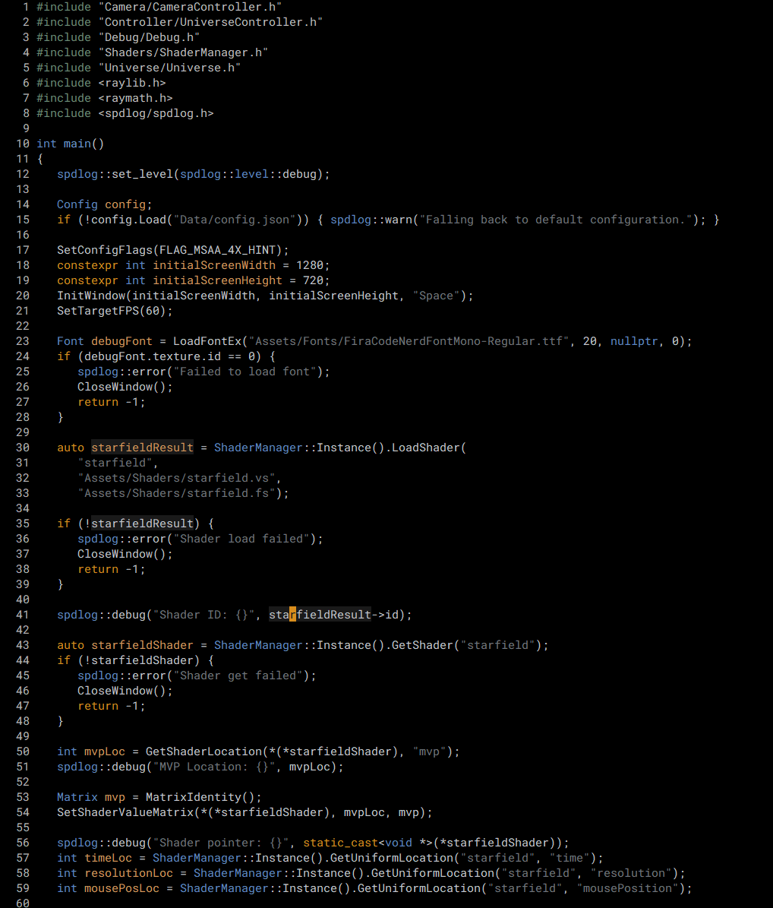

# Voidlight Theme

A **minimal dark theme** for Emacs, designed with subdued tones for comfortable, distraction-free coding. Voidlight combines a **pure black background** with carefully chosen, warm, and muted colors that emphasize readability without being harsh on the eyes. Perfect for extended coding sessions, especially in low-light environments.

## Features

- **Pure black background** for minimal visual distractions.
- Subdued and harmonious color palette:
  - **Orange** for keywords and prompts.
  - **Warm amber** for variables.
  - **Blue** for constants and function names (with a subtle distinction for functions).
  - **Muted gray-green** for includes and preprocessor directives.
  - **Dark gray** for strings and documentation.
- Carefully crafted highlights for **selected regions**, **errors**, and **warnings**.
- Minimal UI design with a **clean mode-line** (no fancy bars).

## Screenshot



> *Note*: Screenshot showcases the theme in a typical programming environment with syntax highlighting for C++.

## Installation

1. Clone the repository or download the theme file:
   ```bash
   git clone https://github.com/christerso/voidlight-theme.git
